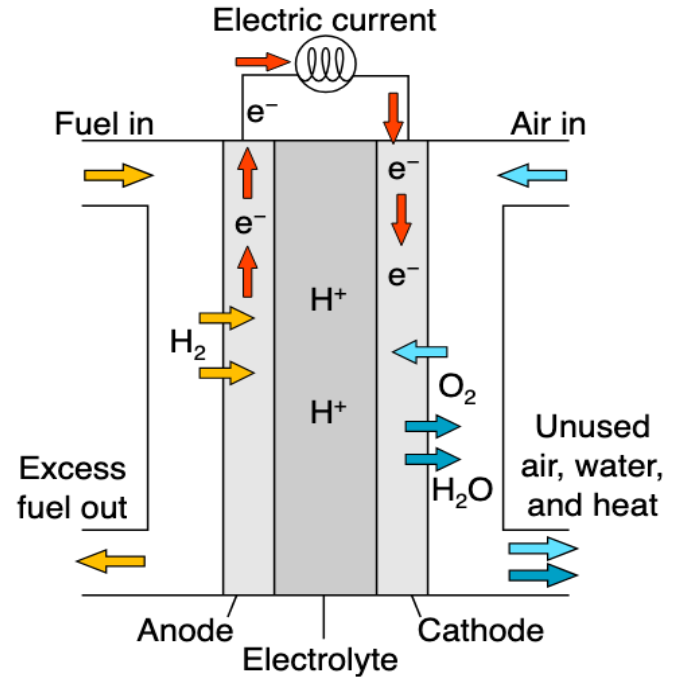

--
title: "
<u><B>Materials Chemistry</B></u>
"
layout: single-portfolio
excerpt: "

"
collection: research
order_number: 50
author_profile: true
header: 
  og_image: "/research/Fuel-cell.png"
---
We mainly foucsed on the system design for higher efficiency of H2O splitting reactions and electrochemical oxygen evolution/reduction reactions (OER/ORR) with lower thermodynamic overpotential. A comprehensive mechanistic and kinetic understanding of water dissociation performance in the innovative bipolar membrane (BPM) is reported by examining six different water splitting mechanisms on inner-layer graphene oxide (GO) catalysts. Meanwhile, ab initio thermodynamic studies of OER/ORR are performed on different candidaites of solid-state surfaces, including single-atom catalysts, carbon nanotubes, and topological Bismuth material.

{: width="600px"}

**Keywords**: <u><B>Water Splitting</B></u>; <u><B>OER/ORR</B></u>; <u><B>Catalysts</B></u>; <u><B>Electric Field</B></u>

**Publications**: 
3. **Zhen Jiang**, Peter P. Bazianos, Zhifei Yan, and Andrew M. Rappe  <i><B> ACS Catal.</B></i> 13(10), 7079-7086 (2023) <a href="https://pubs.acs.org/doi/abs/10.1021/acscatal.3c00891"><u>[DOI]</u></a> 

2. **Zhen Jiang***, Nadia N. Intan, and Qiong Yang <i><B>RSC Adv.</B></i> 12, 33552-33558 (2022) (***: corresponding authors**) <a href="https://pubs.rsc.org/en/content/articlehtml/2022/ra/d2ra06123f"><u>[DOI]</u></a>

1. **Zhen Jiang**, and Vitaly Alexandrov <i><B>J. Phys. Chem. C</B></i> 123, 30335-30340 (2019) <a href="https://pubs.acs.org/doi/abs/10.1021/acs.jpcc.9b07860"><u>[DOI]</u></a>
